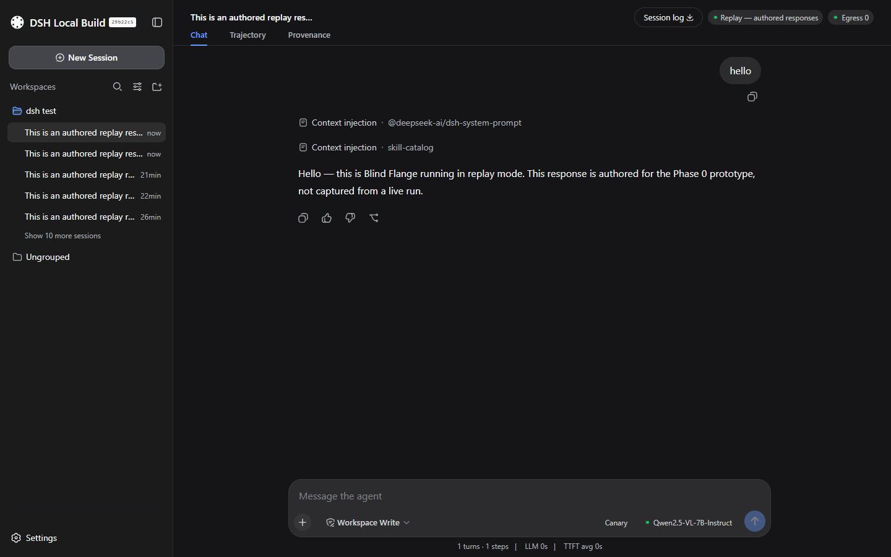
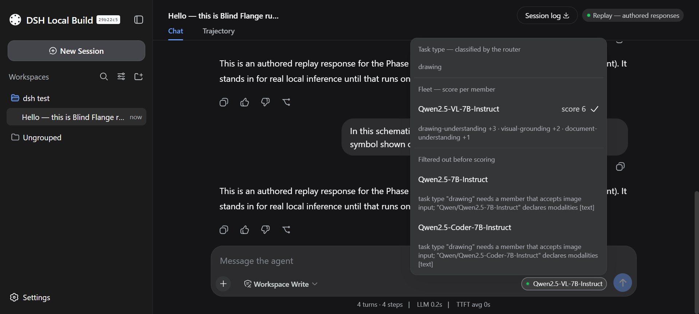
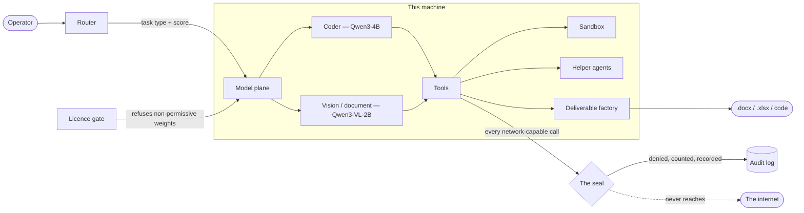

<div align="center">


# Faraday

**A sovereign, air-gapped agentic AI workbench for confidential industrial work.**

Open-weight models on your own GPU. Nothing leaves the machine — and it proves that on screen
instead of claiming it.

[](https://github.com/RudraO2/blind-flange/actions/workflows/ci.yml)
[](LICENSE)
[](https://nodejs.org)
[](docs/licence-policy.md)

Smart India Hackathon 2026 · **SIH26117** · Mangalore Refinery and Petrochemicals Limited

</div>

---

A blind flange is the plate bolted over a pipe to positively isolate it: isolation you can see,
not a policy you have to trust. This is the software version.

Refineries, PSUs and defence-linked plants generate a great deal of routine but sensitive
knowledge work — approval notes, engineering calculations, scanned inspection reports, internal
tooling. None of it can go through a cloud assistant, so it is either done by hand or quietly
pasted into a public tool anyway. Faraday is the third option.

<div align="center">




<sub>The seal reading a counted zero · the router showing its working. Both render in light and dark.</sub>

</div>

## Why this is not Ollama with a chat UI

Three things here refuse to do something, and that is the point. A model runner has no opinion;
a governed workbench does.

| | What it does | Why it matters |
|---|---|---|
| **The licence gate** | Refuses to load a model whose licence is outside eleven permissive names — at runtime, by name, with the reason | Procurement-grade. The audit is part of `npm test`, so an undecided licence **fails the build** |
| **The seal** | Denies outbound calls before they run, counts them, and records each one | The problem statement asks for proof, not a statement. A refused request turns an absence into evidence |
| **The router** | Classifies each request and picks a fleet member itself, showing the score | A dropdown is a human routing. This routes |

## Quick start

```sh
git clone https://github.com/RudraO2/blind-flange.git
cd blind-flange
```

**On Windows, double-click `run.bat`.** It checks the prerequisites, installs what is missing,
downloads the runtime and the models on first run, and opens the workbench fullscreen.

<details>
<summary>Everything <code>run.bat</code> can do, and the terminal equivalents</summary>

```
run.bat            set up if needed, then open fullscreen
run.bat windowed   the same, in an ordinary browser tab
run.bat check      check the install and stop
run.bat setup      set up and stop
run.bat models     download the inference runtime and the two models
run.bat stop       stop the workbench and the inference runtime
```

From a terminal, on any platform:

```sh
npm start                     # set up if needed, then serve http://127.0.0.1:3080
npm run setup                 # everything except starting the app
npm start -- --no-open        # start without opening a browser
npm start -- --port 3081      # any other flag is passed through to the harness
npm run doctor                # check this install and say what, if anything, is wrong
npm test                      # the plugin's tests, then the licence audit
npm run evaluate              # score the lanes against hand-written ground truth
npm run record-demo           # record the demo beats from a running workbench
```

Two prerequisites, both checked before anything is installed: **Node 22.15.0+** and
**pnpm 10.11.0+** (`npm install -g pnpm`).

Every step is idempotent. Run `npm start` again to pick up a change to `profile/` or `plugins/`.

</details>

**If anything looks wrong, run `npm run doctor`.** It checks the toolchain, the profile wiring,
the seal, the tests and the licence audit, and every failure it reports says what to run next.

## Verify the claims without taking our word

Each row is a claim this project makes and the command that settles it. The first three need
nothing but Node — no GPU, no model weights, about a minute.

| Claim | Run this | Evidence |
|---|---|---|
| Every component's licence is decided | `npm run licence-audit` | [`docs/licence-decisions.json`](docs/licence-decisions.json) |
| An undecided licence breaks the build | `npm test` | [`.github/workflows/ci.yml`](.github/workflows/ci.yml) |
| The behaviour is specified and tested | `npm test` | [`plugins/dsh-client-ui-base/test/`](plugins/dsh-client-ui-base/test/) |
| The install is sound and the seal is set | `npm run doctor` | 14 checks, named individually |
| The lanes are right, not just confident | `npm run evaluate` | 10 fixtures with human-written ground truth |
| Decisions were made, not retrofitted | read them | [`docs/adr/`](docs/adr/) — including the reversals |
| It was measured, not assumed | read them | [`docs/measurements/`](docs/measurements/) |

`npm run evaluate` grades by comparing computed values against ground truth a person wrote
down. It documents three cheaper methods it rejected — substring-matching for `PASS`,
self-consistency, and a model judging a model — and why each measures something other than what
it appears to.

## How it fits together



Every network-capable call crosses one line, and that line is a boolean the operator can open —
deliberately, so the instrument can be shown returning both answers. An instrument that can only
ever say "denied" is not an instrument.

## What is real, and what is replayed

Worth being straight about before you judge what you are looking at.

**Real, running on this machine.** The seal and the audit record. The router — it genuinely
classifies and scores. The sandbox: a coding task really executes. Helper agents are real
spawned sessions with their own lineage. The approval note is really written to disk as a
`.docx`. Since 30 August 2026 the model plane is **`local`**: open-weight models on this box's
GPU through llama-swap, which holds one at a time and evicts to make room, because a GTX 1650
Max-Q with 4 GB does not hold two. An attached image goes to the vision member as pixels.

**Replayed, only if you ask.** `replay` remains as an escape hatch — set `modelPlane.provider`
back to `replay` in the profile patch and restart. Answers then come from a hand-authored
cache, disclosed on screen as *Replay — authored responses* the entire time. Everything except
live generation still works, because nothing else depends on which provider answered.

That split is deliberate, and it is on screen rather than hidden. See [ADR-0001](docs/adr/0001-pluggable-model-plane-with-replay-provider.md).
It is also what makes this reproducible on a machine with no GPU.

## The fleet

Declared in [`registry/models.yaml`](registry/models.yaml), one row per model, each with the
licence it was verified under. The loader refuses any row outside the allow-list **before it can
be chosen**, and says so on startup.

| Model | Role | Licence | Status |
|---|---|---|---|
| `Qwen/Qwen3-4B` | coder · calculation | Apache-2.0 | loaded |
| `Qwen/Qwen3-VL-2B-Instruct` | vision · document | Apache-2.0 | loaded |
| `Qwen/Qwen2.5-3B-Instruct` | — | Qwen Research Licence | **refused** |
| `Qwen/Qwen2.5-Coder-3B-Instruct` | — | Qwen Research Licence | **refused** |

The last row is the sharp one. The Qwen2.5-Coder family is Apache-2.0 at 0.5B, 1.5B, 7B, 14B
and 32B — and 3B alone is not. So the size an engineer reaches for when the small model feels
small is the one banned member of the family, and the gate catches it by name rather than by
anyone remembering.

## Where things are

| Path | What it is |
|---|---|
| [`plugins/dsh-client-ui-base/`](plugins/dsh-client-ui-base) | Faraday itself — seal, model plane, router, lanes, attachments, deliverable factory, as one out-of-tree harness plugin |
| [`profile/`](profile) | The harness profile's configuration. The source of truth for what `npm start` writes |
| [`registry/models.yaml`](registry/models.yaml) | The fleet, with licences |
| [`scripts/`](scripts) | `start` · `doctor` · `licence-audit` · `evaluate` · `record-demo` · `fetch-runtime` |
| [`docs/adr/`](docs/adr) | Eight decisions, with their dates, evidence and reversals |
| [`docs/licence-policy.md`](docs/licence-policy.md) | The allow-list, and why it is absolute |
| [`docs/measurements/`](docs/measurements) | What was actually measured on this hardware, and how |
| [`docs/profile-install.md`](docs/profile-install.md) | Every profile change explained, and how to do it by hand |
| [`CONTEXT.md`](CONTEXT.md) | The vocabulary this project uses, and the words it avoids |

Nothing under the harness's own installation is ever edited. Every change Faraday makes is a
profile patch row or an out-of-tree plugin — which is why an operator's own IT department can
audit it, and why removing it is a config edit rather than a rebuild.

## What touches the network

`npm start` does seven things. **Two of them use the network, and only when something is
missing**: installing the pinned harness `@deepseek-ai/dsh@0.1.1-rc.2`, and installing the one
adopted plugin `@changfenhuang/dsh-genui@0.9.3` (MIT). On a machine that already has both,
there is no network use at all. `run.bat models` downloads the runtime and weights once.

After that, nothing fetches anything — not at first use, not later. Every asset the page loads
is served from `127.0.0.1:3080` or a `data:` URI. No font CDN, no icon CDN, no telemetry.

<details>
<summary>If it does not start</summary>

**Run `npm run doctor` first** — it names the problem and what to run. Otherwise:

- **`pnpm was not found on PATH`** — `npm install -g pnpm`, then `npm start` again.
- **The app starts but panels are missing.** The profile's `link:` points at an absolute path;
  if the repository moved or was re-cloned, `npm start` repairs it.
- **A different harness home.** Set `DSH_HOME` and the profile, presets and settings all go
  there instead of `~/.dsh`. This is also how to try a cold start without disturbing an
  existing install.

</details>

## Licence, and the honest part

Faraday is MIT. It is built on **DeepSeek Harness** (MIT) — see
[`THIRD_PARTY_NOTICES.md`](THIRD_PARTY_NOTICES.md) and
[ADR-0003](docs/adr/0003-adopt-deepseek-harness.md).

The project's own rule is **OSI-approved, no copyleft, no user cap, no field-of-use
restriction, no disclosure obligation** — eleven enumerated names across weights, dependencies
and the harness:

> Apache-2.0 · MIT · BSD-2-Clause · BSD-3-Clause · ISC · 0BSD · Python-2.0 · MIT-CMU ·
> BSL-1.0 · Zlib · CC0-1.0

**And the honest part.** "Every component is permissively licensed" would be a stronger
sentence and it would be false. Eight of the audit's rows are copyleft; **two are linked at
runtime** — libvips inside `sharp`, reached through a harness plugin we are forbidden to edit,
and Eigen inside `onnxruntime`. Both are inherited rather than chosen, both are named, and
neither places any obligation on this project's own code. Each is decided one at a time, with
evidence, in [`docs/licence-decisions.json`](docs/licence-decisions.json).

Widening the allow-list is an ADR-level decision, never a judgement call at the point of use,
and copyleft is never admitted by widening it. `PyMuPDF` is AGPL-3.0 and banned by name,
because it is the default an unsupervised agent reaches for; `pypdfium2` is the substitute.
